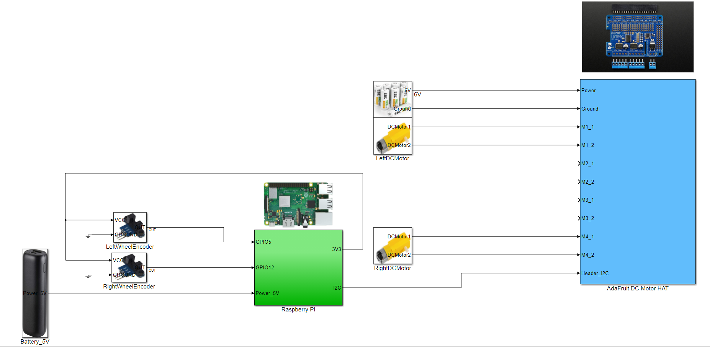

# Mark 01 - The study robot

I am putting together this robot as part of my first robotics project. A robot with I can study multiple common problems in robotics like localization, navigation, hardware, ROS, image processing, control theory, and much more.

Mark 01 is a differential robot that uses a Raspberry PI as the main source of processing.


# Hardware architecture



# Software dependencies

```
sudo pip3 install adafruit-circuitpython-motorkit
sudo pip3 install ds4drv
```
If you are using an old version of Raspberry PI OS you may need to install pygame.

```
sudo pip3 install pygame
```

# Videos

And this project will be followed by a sequence of YouTube videos.

## First steps - Drive motors and PS4 joystick in tank mode

[Add link to the video]
